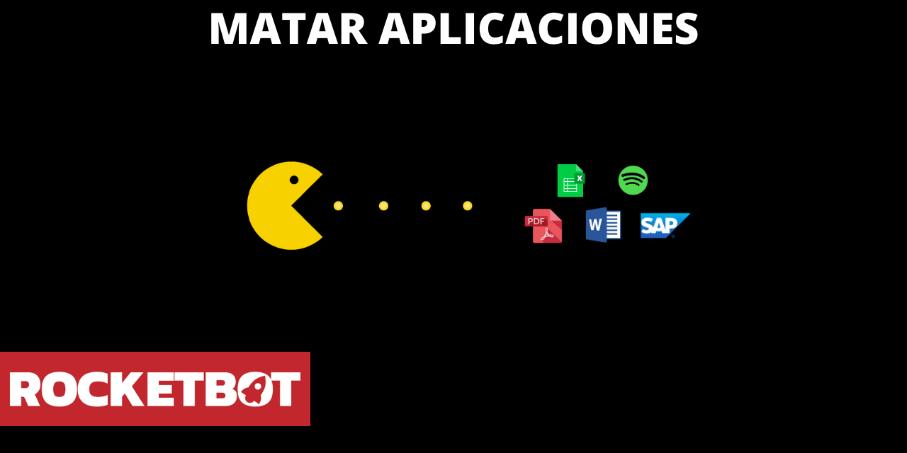

# Matar Aplicativo
  
Mata una aplicación por su nombre  
  

## Como instalar este módulo
  
__Baixe__ e __instale__ o conteúdo na pasta 'modules' no caminho do Rocketbot  

## Descrição do comando

### Matar um Aplicativo
  
Matar um Aplicativo
|Parâmetros|Descrição|exemplo|
| --- | --- | --- |
|Nome da Aplicação||Excel|
|Matar todos os processos|Mate todos os processos de aplicativos|True|